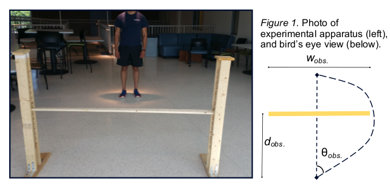
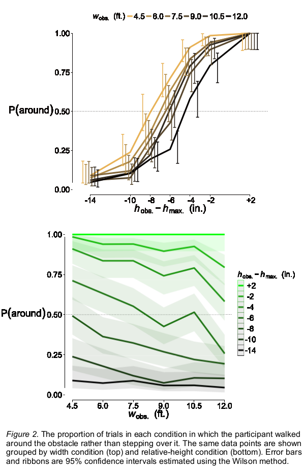
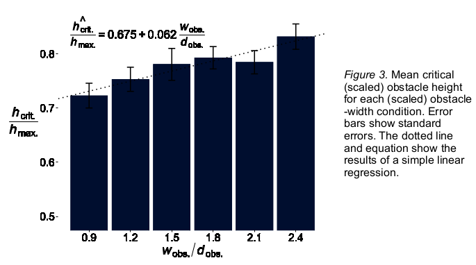
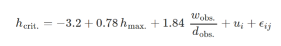

# Selection between differently scaled actions
[ poster](harrison-davis-icpa2015.pdf)

## Introduction
As the environment contains innumerable affordances, organisms must
act upon them selectively. Action selection is the problem of affordance
realization (Davis, 2012).

According to the π-number approach to affordance perception, the
perceivable distinction between possible and impossible actions is
delineated by a dimensionless ratio of environmental dimensions to
organism dimensions (Warren, 1984).

Perceptual scaling need not be by body dimensions; that is merely a
convenient metric for the scientist. Scaling by action capability is a
promising approach (Oudejeans et al., 1996; Fajen, 2005).

Scaling is relevant to not only affordance perception but also affordance
realization. Transitions between two actions occur at body-scaled critical
points (Warren & Whang, 1987; Lopresti-Goodman et al., 2011).

In this study, participants selected between stepping over and walking
around an obstacle of varying height and width. These actions implicate
different dimensions and action capabilities, unlike in previous studies.

## Methods
Twenty University of Connecticut undergraduates participated in this
experiment (10 males; ages 18-20).

Participants walked from a start location to an end location, each a
distance dobs. = 5 ft. from an obstacle between them (pictured in Fig. 1).

We instructed participants to either step over or walk around the obstacle
as was “comfortable, natural, or automatic.” Their choice was recorded
on both the outbound trip and the return to the start position.

We began each session by determining the maximum obstacle height
the participant could step over comfortably (hmax.). This was used as a
baseline for the obstacle heights (hobs.).

Additionally, we measured participants’ knee heights and hip heights.

### Design
- Six obstacle widths (*w*obs.): 4.5, 6, 7.5, 9, 10.5, 12 ft.
- Seven obstacle heights (*h*max.): +2, -2, -4, -6, -8, -10, -14 in. (relative to affordance boundary)

All conditions except +2 in. height were presented twice, fully
randomized, for a total of 78 trials per participant.

## Results
The proportion of trials in each condition exhibiting each action were
calculated. These are shown in Fig. 2.

Participants appeared to trade off obstacle height and obstacle width. As
obstacle width increased, participants were more likely to step over the
obstacle. As obstacle height increased, participants were more likely to walk
around the obstacle.

We ran a series of mixed-effect logistic regressions on the trial outcomes. The
model fit was significantly improved when adding fixed and random effects of
obstacle width, relative obstacle height, and experiment phase (outbound vs.
return), *p* < .001.

### Critical-height analysis
Using logistic regressions, we estimated a critical obstacle height for each
participant and each obstacle width. The critical height was defined as the
height at which the regression predicted that either action was equally likely.
Figure 3 shows the mean critical heights for each obstacle width, scaled by
measured affordance boundary.

We ran mixed-effect linear regressions on these critical heights, with the aim
of determining scaling relationships for the two actions. Tested individually, all
three potential scaling factors for the stepping-over affordance (hip height,
knee height, and maximum afforded height) significantly improved the
regression by roughly the same amount, *Χ*2(1) ≈ 8, *p* < .001.

We tested the ratio of wobs. to dobs. as a potential π-number for the walkingaround
affordance. Its inclusion significantly improved model fit,
*Χ*2(1) = 52.2, *p* < .001. The corresponding random effect was not significant,
*Χ*2(3) = 0.99, *p* > .05.

The final model was

where *u*i is the random-effect intercept for participant *i* and ε*ij* is the
measurement error for participant *i* in condition *j*.

### Affordance-boundary analysis
As a secondary question, we investigated the relationship between
anatomical measurements and participants’ affordance boundaries for
stepping over. A two-way ANOVA of maximum afforded height with predictors
of hip height and knee height showed a significant main effect of hip height,
*F*(1, 16) = 9.64, *p* < .01. Neither the main effect of knee height nor the
interaction between the two measurements was significant, p > .05.

On average, a participant’s observed affordance boundary for stepping over
an obstacle was 74% of his or her hip height.

## Discussion
As one might expect, participants were more likely to step over a shorter
obstacle, and walk around a narrower obstacle. The tradeoff between the
two alternatives can be understood as a competition between
dimensionless quantities, or π-numbers.

The implicated scaling relationships can be varied. Here, we used an
action-scaled π-number (obstacle height as a proportion of maximum
height afforded), and a purely environment-scaled π-number (obstacle
width as a proportion of distance to the obstacle). Note that the latter is
related to the angle required to walk around the obstacle (θobs.).
Specifically, it is twice the tangent.

A future experiment should test the hypothesis that obstacle width is
scaled by obstacle distance.

In reality, there are many more possible scaling relationships that could
affect the selection between two actions. For example, we should
investigate how subjective factors such as the participants’ values are
involved in action selection (see Hodges, 2007).

A synergetic model has been used to model selection between one- and
two-handed grasping (Lopresti-Goodman et al., 2011). This model could
be extended to describe selection between differently scaled actions (see
Frank et al., 2010). To that end, a follow-up experiment testing for
hysteresis is underway.

The origin of the regression coefficients is an important question. Despite
being dimensionless, π-numbers may themselves require calibration.
Alternatively, we should seek out scaling relationships with similar
properties. For example, our π-number for stepping-over ranges from
zero (no extra effort) to one (impossible). Our π-number for walking-around
has the same interpretation of zero, but the action remains
possible as long as the π-number is finite.

We speculate that a complete account of action selection will involve
higher-order π-numbers.

## References
Davis, T. J. (2012). *The role of affordance perception in action-selection*
(Doctoral dissertation). Retrieved from OhioLINK Electronic Theses &
Dissertations Center. (ucin1330024294)

Fajen, B. R. (2005). The scaling of information to action in visually guided
braking. *Journal of Experimental Psychology: Human Perception & Performance, 31*(5), 1107-1123.

Frank, T. D., van der Kamp, J., & Savelsbergh, G. J. (2010). On a multistable
model of behavioral and perceptual infant development. *Developmental Psychobiology, 52*(4), 352-371.

Hodges, B. H. (2007). Values define fields: The intentional dynamics of driving,
carrying, leading, negotiating, and conversing. *Ecological Psychology, 19*(2),
153-178.

Lopresti-Goodman, S. M., Turvey, M. T., & Frank, T. D. (2011). Behavioral
dynamics of the affordance "graspable". *Attention, Perception, and Psychophysics, 73*, 1948-1965.

Oudejeans, R. R., Michaels, C. F., Bakker, F. C., & Dolné, M. A. (1996). *Journal of Experimental Psychology: Human Perception & Performance, 22*(4), 879-
891.

Warren, W. H. (1984). Perceiving affordances: Visual guidance of stair
climbing. *Journal of Experimental Psychology: Human Perception & Performance, 10*(5), 683-703.

Warren, W. H., & Whang, S. (1987). Visual guidance of walking through
apertures: Body-scaled information for affordances. *Journal of Experimental Psychology: Human Perception & Performance, 13*(3), 371-383.

## Further information
Presented July 15, 2015 at the 18th
International Conference on Perception &
Action, University of Minnesota.
