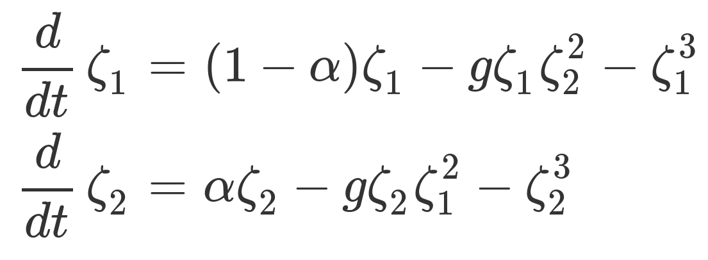

# Catastrophe theory and pattern formation:

### Comparing two approaches for understanding hysteretic transitions
[ poster](harrison-frank-icpa2015.pdf)

## Introduction
Hysteresis is a form of time-dependence in which a system’s
state depends on its history.

For example, whether an object is grasped with one or two
hands depends on the size of the object. As object size is
increased, a participant transitions from one- to two-handed
grasping at a different object size than the reverse transition
as object size is decreased (Lopresti-Goodman et al., 2011).

Positive hysteresis occurs when the transition is delayed;
negative hysteresis occurs when the transition is anticipated.

Two mathematical approaches that predict hysteretic
transitions are catastrophe theory (Guastello, 1995) and the
pattern-formation model (Lopresti-Goodman et al., 2011).
We compared these two models analytically.

In order to illustrate the analytical considerations, we also
conducted two pilot experiments, and fit the models to
sample participant data.
## Catastrophe theory
Geometric analysis of degenerate critical points has revealed
a small number of standard forms. Catastrophe theory is the
study of these forms (Guastello, 1995). The cusp
catastrophe is a standard form in two-dimensional parameter
space. As a result of its bistability, it describes hysteretic
jumps in a continuous state parameter. The cusp
catastrophe is modeled with the equation

where *Y* is the state variable, *a* is an asymmetry parameter,
and *b* is a bifurcation parameter. Hysteresis is observed as a
is varied, at values of b resulting in bistablity. The system is
stable on the surface pictured below, with example hysteretic trajectories pictured.

## Synergetics
The pattern-formation model was developed to understand
hysteretic transitions between one- and two-handed grasping
(Lopresti-Goodman et al., 2011) from the perspective of
synergetics. Coupled pattern amplitudes ζ1 , ζ2 representing
behavioral modes evolve according to

where α is the primary control parameter (e.g., it
corresponds to object size scaled by hand size in grasping
experiments), and the parameter *g* describes the level of
interaction between the pattern amplitudes.

To compare the pattern-formation model with the cusp
model, we introduce a new scalar state variable

We calculated a stability surface for *Z*, pictured below.

## Methods

Two groups of University of Connecticut students (each *N* = 6) participated in the experiments.

**Experiment 1** was adapted from Stewart and Peregoy
(1983). Participants viewed a series of images (from Fisher,
1967; shown to the left) of varying ambiguity and judged
each along a continuous scale between “looks more like a
man’s face” and “looks more like a woman’s figure”.

Each participant experienced three blocks of fifteen trials:
ascending order, descending order, and randomized.
We counterbalanced the order of the ascending and descending
blocks; the random block was always in-between.

**Experiment 2** used a two-choice forced alternative version
of the task. We replaced the continuous scale with a
categorical scale. Participants were forced to choose either
“looks more like a man’s face” or “looks more like a woman’s
figure”.

## Results

Hysteresis was determined using the heuristic method of
Lopresti-Goodman et al. (2011). A similar pattern of
qualitative results was found across the two experiments.

## Modeling
To illustrate the two mathematical approaches, we fit the
models to the data from selective participants. Both models
can exhibit positive hysteresis and no hysteresis. Neither
model, as described here, can exhibit negative hysteresis.

### Cusp model: Continuous responses (Exp. 1)

To fit the cusp model, we allowed *a* and *b* to vary as linear
functions of the image number and *Y* as a linear function of
the participant response (see Grasman et al., 2009).

In this way, we fit the model to the data of participant 1, who
exhibited no hysteresis, and participant 6, who exhibited
positive hysteresis. The results are shown below.

### Pattern-formation model: Categorical responses (Exp. 2)
We used the procedure of Lopresti-Goodman et al. (2011) to
fit the data from participant #2.

Model parameters were determined to reproduce an
ascending transition between images 9 and 10, and a
descending transition between images 7 and 8. A simulation
with the resulting parameters is shown below.

The pattern-formation model can also capture the qualitative
results from the participant exhibiting no hysteresis (not
shown).

## Discussion

### Analytical findings
In terms of a scalar state variable *Z*, the pattern-formation
model exhibits a stability surface similar to the cusp model.
Catastrophe theory describes transitions with a scalar

variable, whereas the pattern-formation approach describes
transitions using winner-take-all pattern amplitudes. That is,
they focus on different levels of description.

Unlike the cusp model, the pattern-formation model predicts
jump-like transitions even when no hysteresis is present.

### Empirical findings
The pattern-formation model can capture data from
participants showing perceptual switches between two
categorical responses with positive hysteresis.

The cusp model can capture data from participants showing
changes in continuous perceptual judgments with positive
hysteresis.

Negative hysteresis was observed experimentally. Neither
model, as described here, can explain these results. The
pattern-formation model has been extended with a
parameter-dynamics level to address negative hysteresis
(Lopresti-Goodman et al., 2013). Likewise for the cusp
model (Tuller et al., 1994).

Both of these extensions involve an additional parameter
that varies during the course of the experiment. This
additional variable may correspond to an internal dynamic
such as perceptual adaptation.

Negative hysteresis may be related to presentation speed.
Faster presentation speed is associated with negative
hysteresis (Lopresti-Goodman et al., 2011).

Future studies should examine to what extent continuous
response data can be fitted to the *Z* response variable of the
pattern-formation model.

## References
Fisher, G. H. (1967). Preparation of ambiguous stimulus
materials. *Perception & Psychophysics, 2*(9), 421-422.

Grasman, R. P., van der Maas, H. L., & Wagenmakers, E. (2009).
Fitting the cusp catastrophe in R: A cusp package primer.
*Journal of Statistical Software, 32(*8), 1-27.

Guastello, S. J. (1995). *Chaos, catastrophe, and human affairs*.
Mahwah, NJ: Lawrence Erlbaum.

Lopresti-Goodman, S. M., Turvey, M. T., & Frank, T. D. (2011).
Behavioral dynamics of the affordance "graspable". Attention,
*Perception, and Psychophysics, 73*, 1948-1965.

Lopresti-Goodman, S. M., Turvey, M. T., & Frank, T. D. (2013).
Negative hysteresis in the behavioral dynamics of the
affordance "graspable". *Attention, Perception, and Psychophysics, 75*, 1075-1091.

Stewart, I. N., & Peregoy, P. L. (1983). Catastrophe theory
modeling in psychology. *Psychological Bulletin, 94*(2), 336-362.

Tuller, B., Case, P., Ding, M., & Kelso, J. A. (1994). The nonlinear
dynamics of speech categorization. *Journal of Experimental Psychology: Human Perception and Performance*, 20, 3–16.

## Further information
Presented July 17, 2015 at the 18th
International Conference on Perception &
Action, University of Minnesota.
